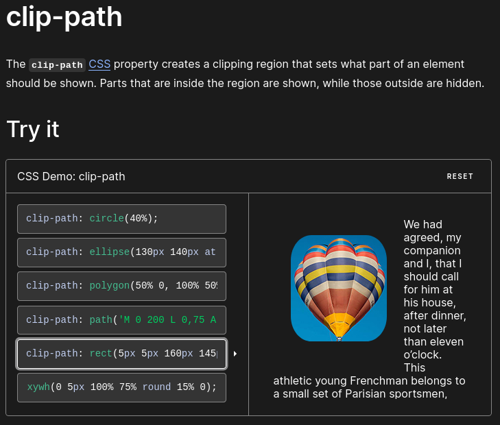

# Aufgabe "Animated Portfolio"

## task 1 - dropdown menu with :hover

## task 2 - use clip-path animation
-   link zu MDN docs [(https://developer.mozilla.org/en-US/docs/Web/CSS/clip-path)]



### relevante CSS Syntax: 

```css
/* Keyword values */
clip-path: none;

/* <clip-source> values */
clip-path: url(resources.svg#c1);

/* <geometry-box> values */
clip-path: margin-box;
clip-path: border-box;
clip-path: padding-box;
clip-path: content-box;

/* <basic-shape> values */
clip-path: inset(100px 50px);
clip-path: circle(50px at 0 100px);
clip-path: ellipse(50px 60px at 0 10% 20%);
clip-path: polygon(50% 0%, 100% 50%, 50% 100%, 0% 50%);
clip-path: rect(5px 5px 160px 145px round 20%);
clip-path: xywh(0 5px 100% 75% round 15% 0);

/* Box and shape values combined */
clip-path: padding-box circle(50px at 0 100px);
```

#### in dieser Aufgabe wird die Form "rectangle" gebraucht;

- ``rect()``
Defines a rectangle using the specified distances from the edges of the reference box.

```css
clip-path: rect(5px 5px 160px 145px round 20%);

```